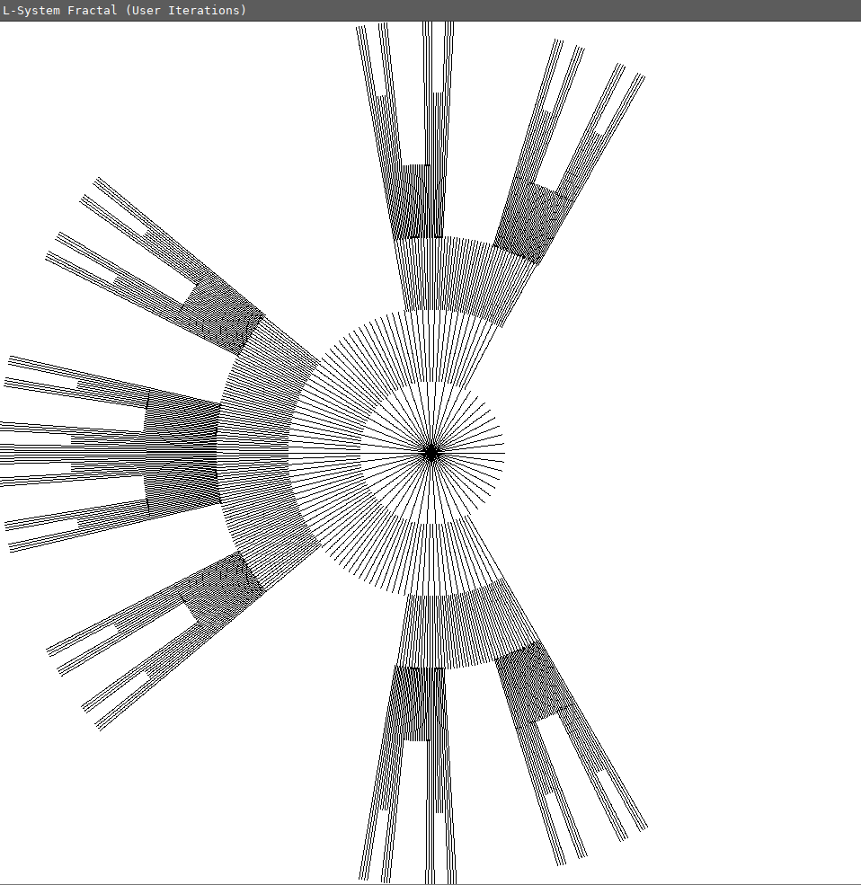
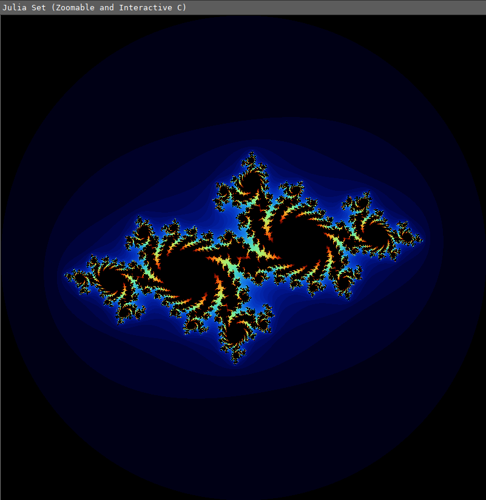

# Fractals

This repository explores various fascinating fractals coded in pure C using [SDL2](https://www.libsdl.org/) for graphics rendering. Each fractal implementation aims to be interactive, allowing for zooming, panning, and screenshot capabilities.

---

## Implemented Fractals

| Fractal                      | Image                                                 | Wikipedia                                              |
| :--------------------------- | :---------------------------------------------------- | :----------------------------------------------------- |
| **Mandelbrot Set**           |               | https://en.wikipedia.org/wiki/Mandelbrot_set           |
| **Cantor Set**               |                       | https://en.wikipedia.org/wiki/Cantor_set               |
| **Burning Ship**             |                | https://en.wikipedia.org/wiki/Burning_Ship_fractal     |
| **Julia Set**                |                         | https://en.wikipedia.org/wiki/Julia_set                |
| **Koch Snowflake**           |            | https://en.wikipedia.org/wiki/Koch_snowflake           |
| **Sierpinski triangle**      |  | https://en.wikipedia.org/wiki/Sierpi%C5%84ski_triangle |
| **Newton fractal**           |                   | https://en.wikipedia.org/wiki/Newton_fractal           |
| **Lyapunov swallow Fractal** |       | https://en.wikipedia.org/wiki/Lyapunov_fractal         |
| **Vicsek Fractal**           |           | https://en.wikipedia.org/wiki/Vicsek_fractal           |
| **Lorenz Attractor**         |       | https://en.wikipedia.org/wiki/Lorenz_system            |
| **Dragon Curve**             |                | https://en.wikipedia.org/wiki/Dragon_curve             |
| **Barnsley Fern Fractal**    |      | https://en.wikipedia.org/wiki/Barnsley_fern            |
| **Tricorn Fractal**          |                 | https://en.wikipedia.org/wiki/Tricorn_(mathematics)    |

---

## Dependencies

To compile and run these fractal programs, you'll need the SDL2 development libraries, specifically `libsdl2-dev` and `libsdl2-ttf-dev`.

**On Debian/Ubuntu:**

```bash
sudo apt-get update
sudo apt-get install libsdl2-dev libsdl2-ttf-dev
```

On Fedora/RHEL:

```bash
sudo dnf install SDL2-devel SDL2_ttf-devel
```

On macOS (using Homebrew):

```bash
brew install sdl2 sdl2_ttf
```

---

## License

This project is licensed under the MIT License. See the [LICENSE](LICENSE) file for details.
