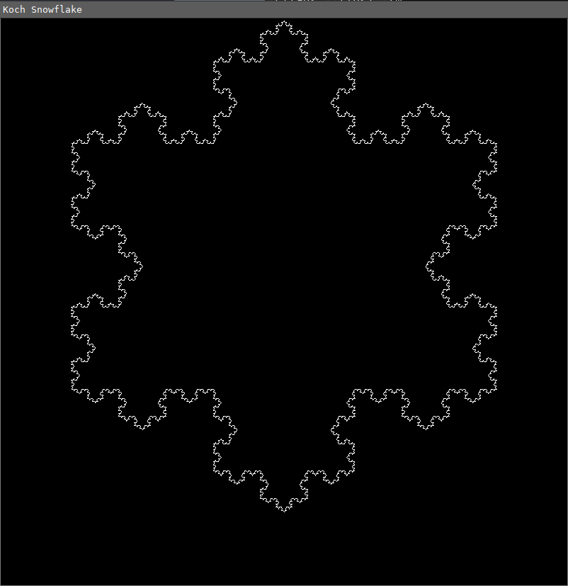

# Fractals

This repository explores various fascinating fractals code in pure C usinf [SDL2](https://www.libsdl.org/) .

---

| Fractal                      | Image                                                 | Wikipedia                                              |
| :--------------------------- | :---------------------------------------------------- | :----------------------------------------------------- |
| **Mandelbrot Set**           |               | https://en.wikipedia.org/wiki/Mandelbrot_set           |
| **Cantor Set**               |                       | https://en.wikipedia.org/wiki/Cantor_set               |
| **Burning Ship**             |                | https://en.wikipedia.org/wiki/Burning_Ship_fractal     |
| **Julia Set**                |                         | https://en.wikipedia.org/wiki/Julia_set                |
| **Koch Snowflake**           |            | https://en.wikipedia.org/wiki/Koch_snowflake           |
| **Sierpinski triangle**      |  | https://en.wikipedia.org/wiki/Sierpi%C5%84ski_triangle |
| **Newton fractal**           |                   | https://en.wikipedia.org/wiki/Newton_fractal           |
| **Lyapunov swallow Fractal** |       | https://en.wikipedia.org/wiki/Lyapunov_fractal         |

---

## Dependencies

To run this project, you'll need the following dependency:

```bash
sudo apt-get install libsdl2-ttf-dev
```
